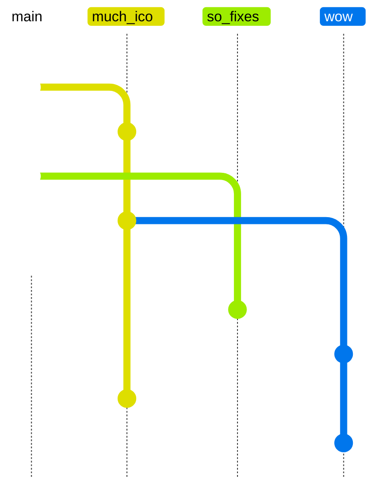
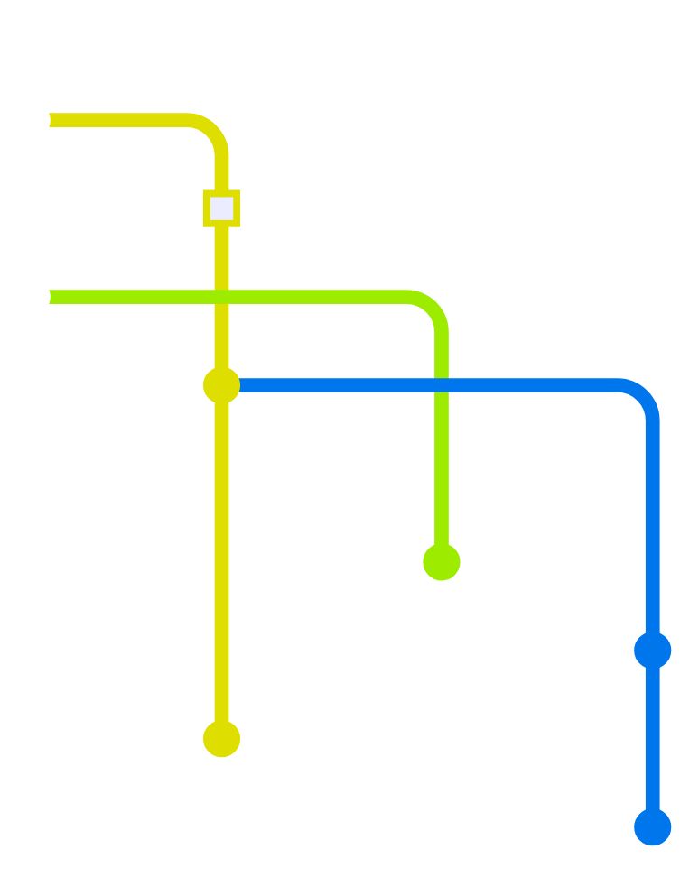
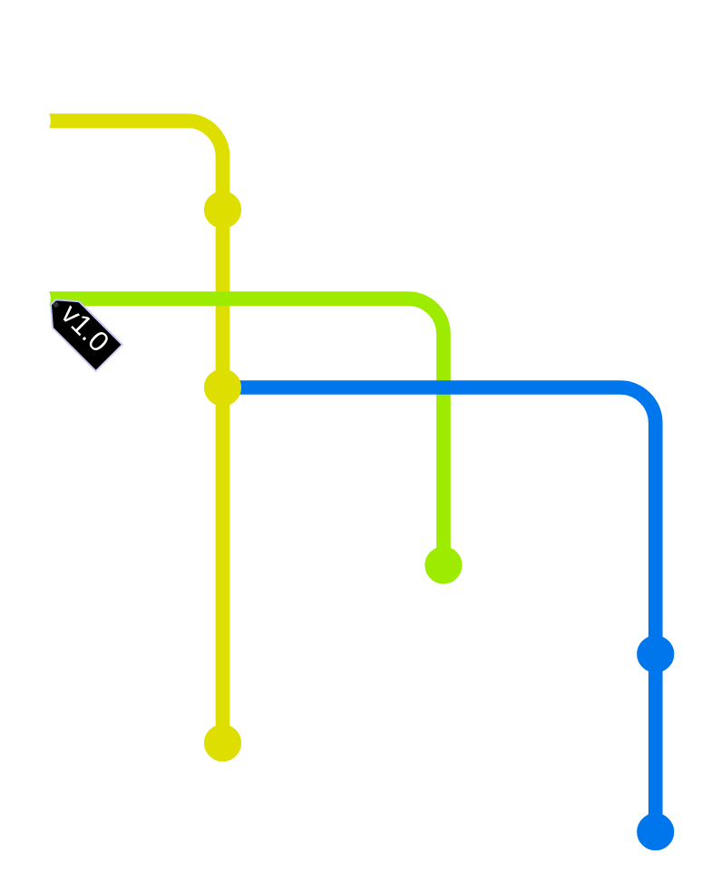
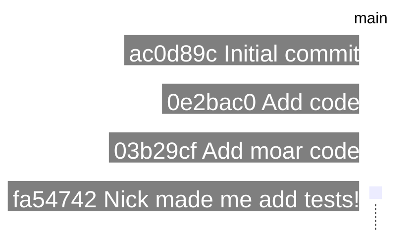
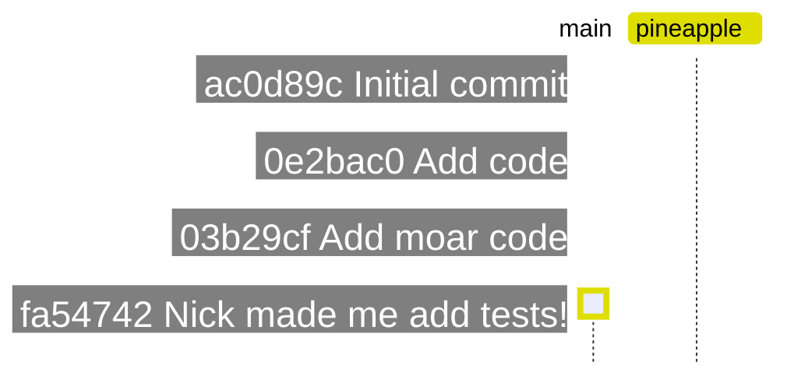
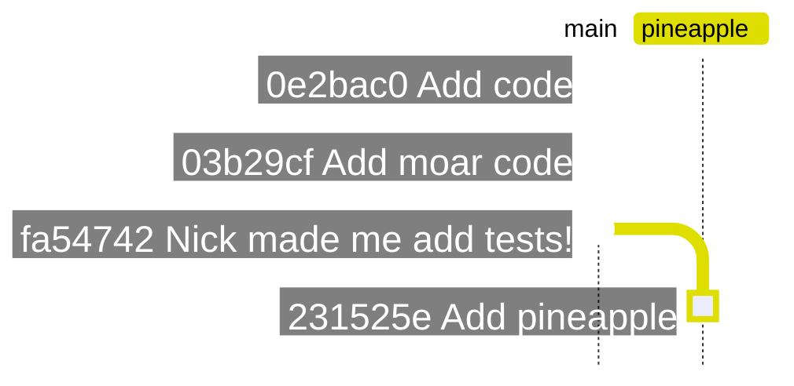
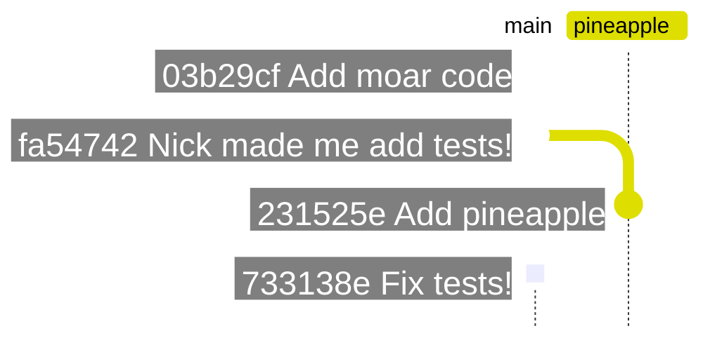
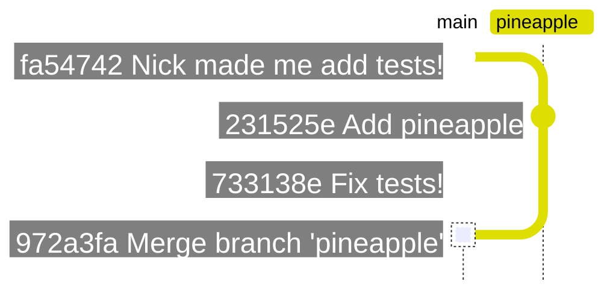
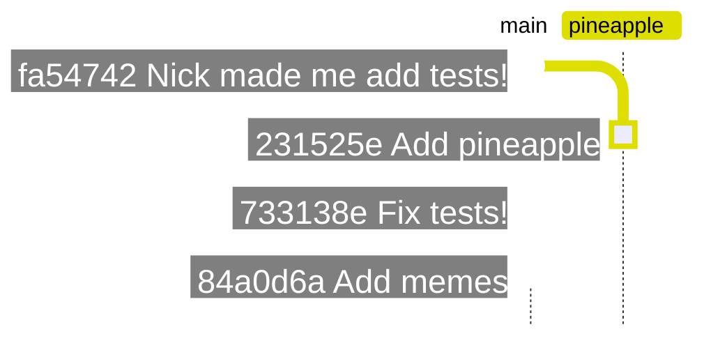
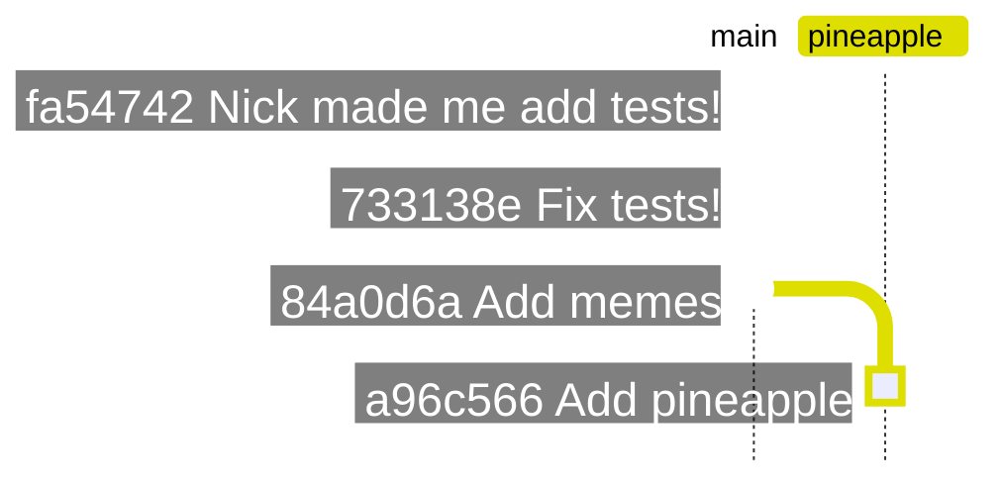

## Git Misinformation

How to lose code and infuriate people

[James Taylor](https://github.com/jt-nti)

---

## This is not your first time

You've already set everything up, e.g.

```console
    $ git config --global user.name "Block Norris"
    $ git config --global user.email conga@example.org
    $ _
```

🔖 [Getting Started](https://www.git-scm.com/book/en/v2/Getting-Started-First-Time-Git-Setup)

---

{}

## Git is simple

It's commits all the way down...


---

And branches...



---

And a HEAD...


---

(Which can become detached!)



---

You can also tag things...



---

Simple!

{}

---

{}

## Time to code!

Those bugs aren't going to write themselves...

---



---

```console
$ git checkout -b pineapple
Switched to a new branch 'pineapple'
$ _
```

---



---

```javascript
console.log("Unexpected pineapple");
```

---


---

```console
$ git add -A
$ git commit -s -m "Add pineapple"
[pineapple 231525e] Add pineapple
1 file changed, 0 insertions(+), 0 deletions(-)
create mode 100644 pineapple.js
$ _
```

---



---

```console
$ git checkout main
Switched to branch 'main'
$ _
```

---

{}⏲{}

Time passes...

---



---

```console
$ git merge pineapple
Merge made by the 'recursive' strategy.
 pineapple.js | 0
 1 file changed, 0 insertions(+), 0 deletions(-)
 create mode 100644 pineapple.js
$ _
```

---



---

Simple...

🔖 [Basic Branching and Merging](https://www.git-scm.com/book/en/v2/Git-Branching-Basic-Branching-and-Merging)

---

...except when there are other people!

{}🐧 🐧 🐧{}

{}

---

{}

## Git is distributed

Flexible, but this is pretty common...

---

upstream repository

{}🚀{}

_Which you fork..._

---

origin repository

{}🛰{}

_Which you clone..._

---

local repository

{}💻{}

_Which you swear at!_

---

```console
$ git remote -v
origin  git@github.com:jt-nti/composer.git (fetch)
origin  git@github.com:jt-nti/composer.git (push)
dselman git@github.com:dselman/composer.git (fetch)
dselman git@github.com:dselman/composer.git (push)
upstream git@github.com:hyperledger/composer.git (fetch)
upstream git@github.com:hyperledger/composer.git (push)
$ _
```

🔖 [Working with Remotes](https://git-scm.com/book/en/v2/Git-Basics-Working-with-Remotes)

{}

---

{}

## Time to collaborate!

Share all the bugs...

---



---

```console
$ git rebase main
First, rewinding head to replay your work on top of it...
Applying: Add pineapple
$ _
```

---



---

No conflicts!

{}🎉{}

_Except..._

---

It's not the same commit!

{}🔥{}

🔖 [Rewriting History](https://www.git-scm.com/book/en/v2/Git-Tools-Rewriting-History)

---

```console
$ git push --force-with-lease origin pineapple
Counting objects: 24, done.
Delta compression using up to 8 threads.
Compressing objects: 100% (15/15), done.
Writing objects: 100% (24/24), 1.91 KiB | 0 bytes/s, done.
Total 24 (delta 2), reused 0 (delta 0)
To https://github.com/jt-nti/composer
    * [new branch]      pineapple -> pineapple
$ _
```

---

{}🚨{}

⚠️ Don't force push to main!

{}

---

{}

## Tips

Get Tower...

---

Always start in a new branch...  
_and make sure it's based on the latest upstream main!_

```console
$ git status
On branch main
Your branch is up-to-date with 'origin/main'.

nothing to commit, working tree clean
$ git pull upstream main
remote: Enumerating objects: 56, done.
...
32 files changed, 123 insertions(+), 123 deletions(-)
$ git checkout -b pineapple
Switched to a new branch 'pineapple'
$ _
```

🔖 [Remote Branches](https://www.git-scm.com/book/en/v2/Git-Branching-Remote-Branches)

---

`git status` is your friend

```console
$ git status
On branch main
Your branch is ahead of 'origin/main' by 2 commits.
    (use "git push" to publish your local commits)

nothing to commit, working tree clean
$ _
```

---

`git log` is the enemy of your enemy

```console
$ git log -n 5 --oneline
2f07943c0 (HEAD -> main, upstream/main, add-migration) bump to version 0.20.3 (#4459)
3b9de768d (tag: v0.20.2) Add cloud wallet implementations to docker images (#4456)
860536f52 (origin/main, origin/HEAD) [Main] Add caveats/advisory for scope of generators (Angular/CLI) plus Multi-Org Fabric v1.2.1 update (#4451)
5e2abe271 [Main] Upgrade Shim (#4453)
f635247c3 [main] remove info about community calls (#4450)
$ _
```

---

One commit is usually plenty...  
_and much easier to rebase!_

```console
$ git commit --amend
[pineapple 0acce17] Add pineapple
 Date: Wed Oct 17 13:52:04 2018 +0100
 3 files changed, 0 insertions(+), 0 deletions(-)
 create mode 100644 ham.js
 create mode 100644 pineapple.js
 create mode 100644 pizza.js
$ _
```

---

Oh, you already have more than one commit...

```console
$ git log --oneline -n 4
c7005cd (HEAD -> pineapple) Code code code
475b463 Hacking is fun
f97caf5 Hack stuff
e62064c Initial commit
$ git rebase -i HEAD~3
...pick, squash, squash...
Successfully rebased and updated refs/heads/pineapple.
$ git log --oneline -n 2
64cbfb5 (HEAD -> pineapple) Add pineapple
e62064c Initial commit
$ _
```

---

That's not my commit...  
_its changes do not need amending!_

```console
$ git commit --amend
Aborting commit due to empty commit message.
$ _
```

---

Prefer commits to stashing...  
_unless it's something quick_

```console
$ git stash
Saved working directory and index state WIP on pineapple: f96a461 Fix stuff
$ _
...
$ git stash apply
On branch pineapple
Changes to be committed:
 (use "git reset HEAD &lt;file&gt;..." to unstage)

 new file:   upside-down-cake.js

$ _
```

🔖 [Stashing](https://www.git-scm.com/book/en/v2/Git-Tools-Stashing-and-Cleaning)

---

If you're worried, create another branch!

```console
$ git checkout -b pineapple-backup
Switched to a new branch 'pineapple-backup' 
$ _
```

---

Don't panic...  
_your changes are probably somewhere!_


```console
$ git reflog show -n 2
073d926 HEAD@{0}: commit (amend): Add pineapple
733da01 HEAD@{1}: commit: Add pineapple
$ git reset --soft HEAD@{1}
$ _
```

- `HEAD~1`
- `HEAD@{1}`
- `64cbfb5`

---

Cherry pick for victory!

```console
$ git cherry-pick 073d926
[pineapple f96a461] Fix stuff
 Date: Wed Oct 17 11:47:37 2018 +0100
 1 file changed, 0 insertions(+), 0 deletions(-)
 create mode 100644 fix.txt
$ _
```

---

{}🚨{}

⚠️ Don't force push to main!

{}

---

{}

## Useful Tools

Did I mention Tower?

---

- [Tower](https://www.git-tower.com/)
- [P4Merge](https://www.perforce.com/products/helix-core-apps/merge-diff-tool-p4merge)
- [GitLense (VSCode)](https://gitlens.amod.io)

{}

---

{}

## Questions?

Try here...

---

- [Git Flight Rules](https://github.com/k88hudson/git-flight-rules)
- [Git Handbook](https://guides.github.com/introduction/git-handbook/)
- [Git Guide](http://rogerdudler.github.io/git-guide/)
- [First Aid Git](http://firstaidgit.io/#/)
- [Oh shit, git!](https://ohshitgit.com/)
- [Git pretty](http://justinhileman.info/article/git-pretty/)
- [Git Out Of Trouble](https://services.github.com/on-demand/git-trouble/)

{}

---

## PS.

{}🚨{}

⚠️ Don't force push to main!
